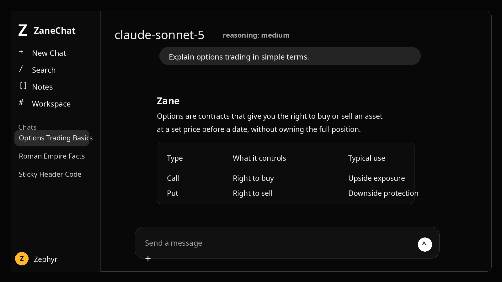
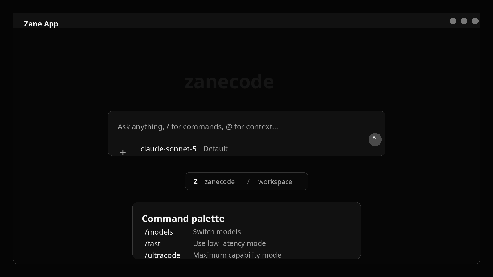
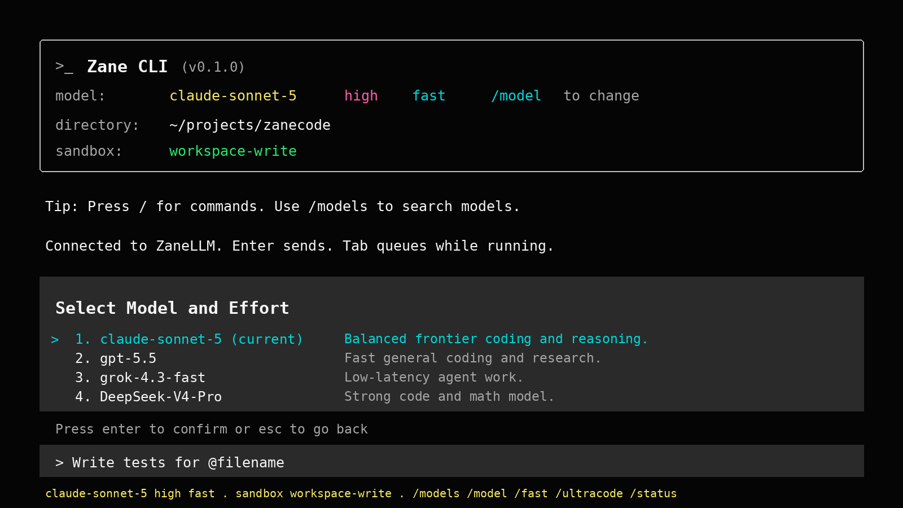

# ZaneCode

ZaneCode is the Zane AI workspace. It gives you one account-backed setup for chat, desktop, terminal, and coding CLIs.



## What You Get

- **ZaneChat**: web chat and local AI gateway.
- **ZaneApp**: desktop app for coding sessions.
- **ZaneCLI**: terminal UI through `zanecli` and `zanecode`.
- **CLI wrappers**: run popular coding CLIs through your Zane models with commands like `zanecc`, `zanegpt`, `zaneoc`, `zaneh`, and `zanegrokcli`.



## How It Works

ZaneCode connects to your artemisiahub.com account with an access token from your profile.

1. Open `https://artemisiahub.com`.
2. Sign in and go to your profile.
3. Create or copy an access token.
4. Run the ZaneCode installer.
5. Paste the token only into the local secure prompt when asked.

The setup then creates or reuses your model API token, syncs ModelSquare provider groups and models, configures ZaneChat, and writes local CLI/app config.

Your artemisiahub access token is not committed to the repo. Local credentials live under:

```text
~/.config/zane-cli/credentials.env
~/.config/zane-cli/config.json
```

## Install

```bash
git clone https://github.com/zephyrzane/zanecode.git
cd zanecode
zane install
zanecode
```

If `zane` is not available yet from your shell, run the local installer directly:

```bash
./integrations/zane-cli/bin/zane install
```

## Main Commands

```bash
zanechat       # start ZaneChat web UI and gateway
zaneapp        # start ZaneApp
zanecli        # start ZaneCLI
zanecode       # alias for ZaneCLI
zaneupdate     # refresh models from artemisiahub ModelSquare
zane models    # list models exposed by the local gateway
zane use MODEL # set the default model for wrappers
zane status    # show local bridge status
```



## Use Zane Models In Other CLIs

ZaneCode installs wrapper commands so you can keep using familiar terminal tools while routing them through ZaneLLM.

```bash
zanegpt        # Codex-style CLI through Zane
zanecodex      # Codex-style CLI through Zane
zanecc         # Claude Code through Zane
zaneoc         # open coding sessions through Zane
zaneh          # Hermes through Zane
zanehermes     # Hermes through Zane
zanegrokcli    # Grok CLI through Zane
```

The original tools stay untouched. The `zane*` commands use your local Zane config and model list.

## Refresh Models

When artemisiahub ModelSquare adds, removes, or renames models, run:

```bash
zaneupdate
```

This refreshes provider groups, removes stale local model entries, and updates ZaneChat/ZaneCLI/ZaneApp model catalogs.

## Local Gateway

ZaneCode exposes local compatible endpoints for apps and CLIs:

```text
OpenAI-compatible:      http://127.0.0.1:8080/zanellm/v1
OpenAI Responses-style: http://127.0.0.1:8080/openai
Anthropic-compatible:   http://127.0.0.1:8080/anthropic
```

Use these with the locally generated API key from ZaneCode config when a tool asks for a base URL and key.

## Project Names

- **ZaneChat** is the web UI and gateway.
- **ZaneApp** is the desktop app.
- **ZaneCLI** is the terminal UI.
- **ZaneCode** is the full package that installs and connects all of them.

## Security

Do not commit API keys, access tokens, local databases, generated app data, or files from `~/.config/zane-cli`.
